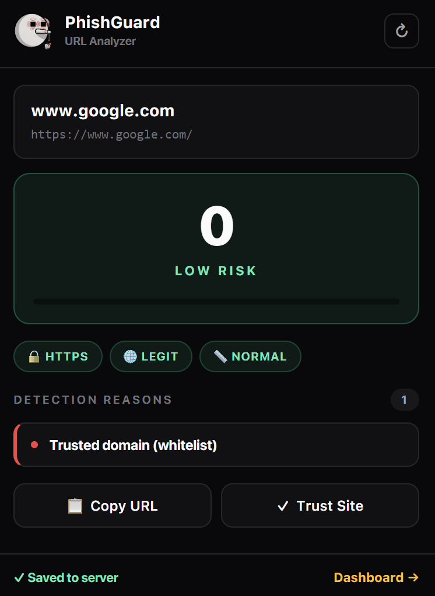
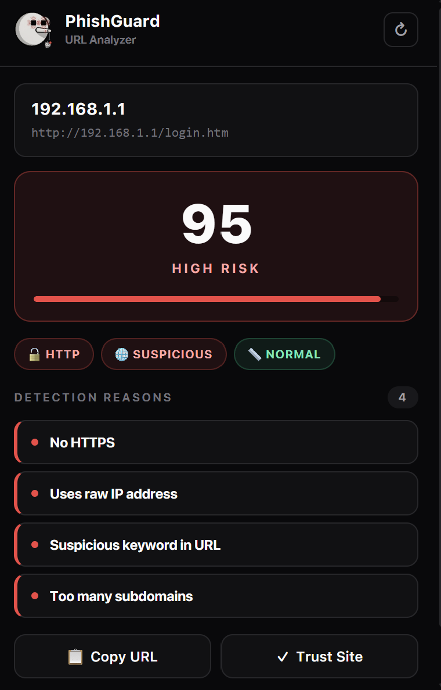
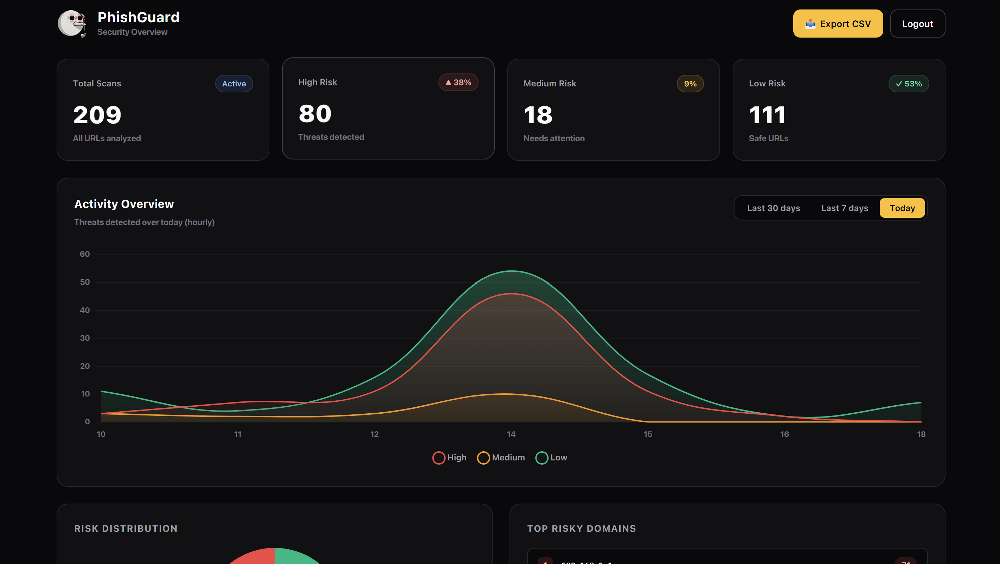

<div align="center">

# 🛡️ PhishGuard

**Real-time phishing detection for Chrome and Brave**

[](LICENSE)
[](https://developer.chrome.com/docs/extensions/mv3/)
[](https://php.net)
[](https://mysql.com)

Analyzes every URL you visit, scores it 0–100, and warns you before you enter data on a phishing page.

</div>

---

## 📸 Screenshots

<table>
  <tr>
    <td align="center">
      <br/>
      <b>🟢 Safe site</b><br/>
      <sub>Whitelisted — score 0</sub>
    </td>
    <td align="center">
      <br/>
      <b>🔴 Phishing detected</b><br/>
      <sub>Score 100 — 5 rules triggered</sub>
    </td>
    <td align="center">
      <br/>
      <b>📊 Admin dashboard</b><br/>
      <sub>Charts, filters, CSV export</sub>
    </td>
  </tr>
</table>

---

## ✨ Features

- ⚡ **Real-time** URL analysis on every tab
- 🎯 **11 detection rules** with weighted scoring
- 🎨 **Per-tab colored badge** (✓ / ! / ⚠)
- 🔔 **Desktop notifications** on high-risk sites
- ✅ **Trust Site** button (custom whitelist)
- 📊 **Admin dashboard** with charts + CSV export

---

## 🏗️ Architecture

```
┌─────────────┐      ┌────────────┐      ┌─────────┐      ┌────────────┐
│  Extension  │─────▶│  PHP API   │─────▶│  MySQL  │◀─────│ Dashboard  │
│  (Manifest  │      │ (4 routes) │      │ (2 tbl) │      │  (Chart.js)│
│      V3)    │      └────────────┘      └─────────┘      └────────────┘
└─────────────┘
```

---

## 🚀 Quick Start

```bash
# 1. Clone into XAMPP
cd C:\xampp\htdocs
git clone https://github.com/aminearea/phishguard.git

# 2. Import database/phishguard.sql in phpMyAdmin

# 3. Copy backend/config.example.php → backend/config.php

# 4. Load extension/ folder in brave://extensions

# 5. Open http://localhost/phishguard/dashboard/
#    Login: admin / admin123
```

---

## 🧠 Detection Rules

| # | Rule | Weight |
|:-:|------|:------:|
| 1 | No HTTPS | +30 |
| 2 | Raw IP address | +30 |
| 3 | Suspicious keyword | +20 |
| 4 | Contains `@` in URL | +20 |
| 5 | Punycode hostname | +25 |
| 6 | Tunneling service (Cloudflare/Ngrok) | +40 |
| 7 | Too many subdomains | +15 |
| 8 | Auto-generated subdomain | +15 |
| 9 | URL shortener | +15 |
| 10 | Very long URL | +10 |
| 11 | HTML file in path | +10 |

Score is capped at 100 · Whitelisted domains always return **0**.

---

## 🔌 API Endpoints

| Method | Endpoint | Purpose |
|:------:|----------|---------|
| `POST` | `/backend/scan.php` | Save a scan |
| `GET`  | `/backend/scans.php` | List scans |
| `GET`  | `/backend/stats.php` | Statistics |
| `POST` | `/backend/login.php` | Admin login |

---

## 🧪 Test URLs

| URL | Result |
|-----|:------:|
| `https://google.com` | 🟢 0 |
| `http://neverssl.com` | 🟠 30 |
| `http://192.168.1.1/login.htm` | 🔴 100 |
| `https://xxx.trycloudflare.com/login.html` | 🔴 85 |

---

## 📄 License

MIT — see [LICENSE](LICENSE).

---

<div align="center">
<sub>Built by <b>Amine</b> · 3rd year EMI student</sub>
</div>
